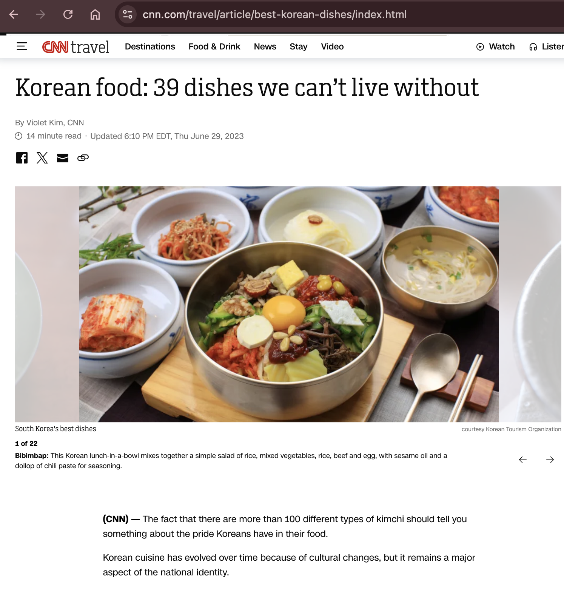
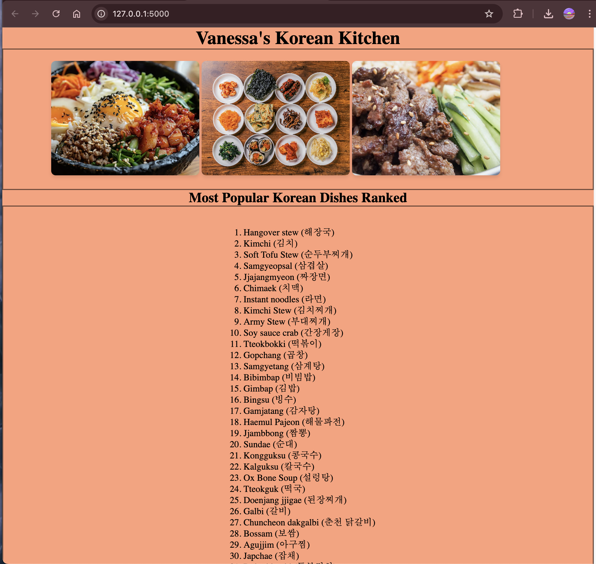

# Knowledge Check 1 - Webscraping News Site

For this week's knowledge check, I was tasked to perform webscraping of a news site, store the data into a sql database, and display it on a web interface. I tackled this in four steps.

1. Create a simple app via Flask
2. Set up a sql database via SQLAlchemy & SQLite engine
3. Gather data from a CNN article via BeautifulSoup

4. Display the content dynamically to HTML webpage via Flask

