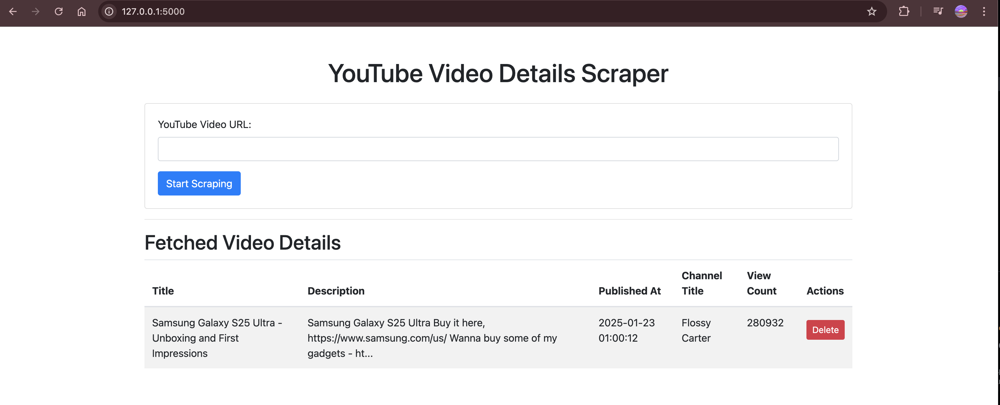
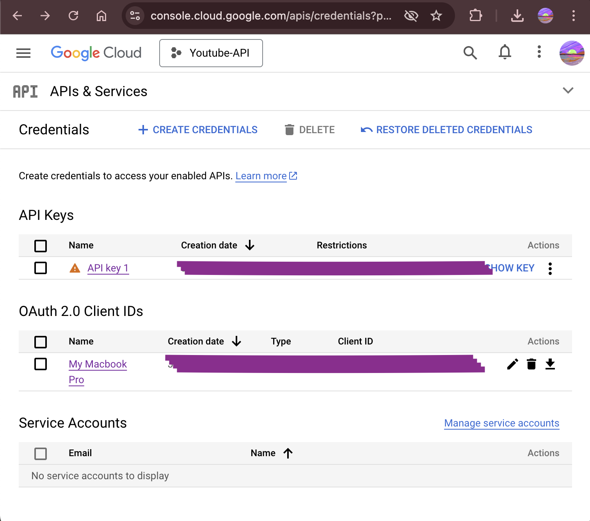

# YouTube Video Details Scraper

A Flask-based web application to scrape, store, and display details of YouTube videos. This app uses the YouTube Data API to fetch video details such as title, description, publish date, channel name, and view count, and stores them in a PostgreSQL database.

## Features

- Extracts video details from YouTube URLs.
  
- Stores the details in a PostgreSQL database.
  
- Deletes video details from the database.
- Implements rate limiting to prevent abuse of the API.
- Requires Youtube Oauth 2 Authorization for security and anti-bot measures.
  
- Uses environment variables for secure configuration.
