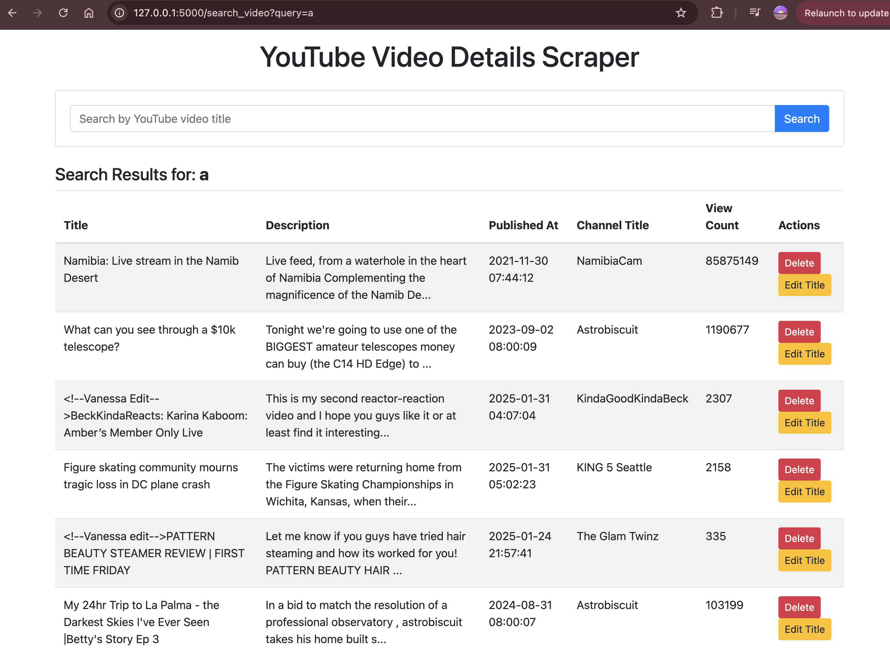
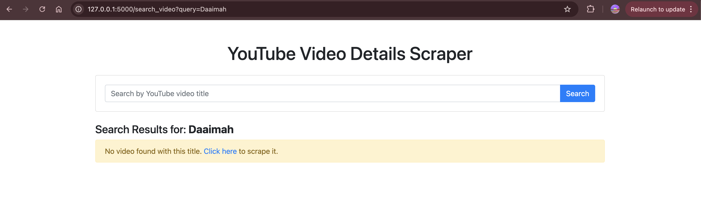
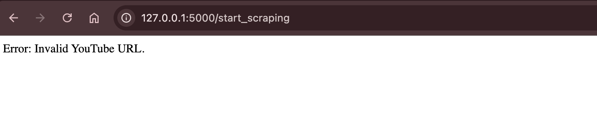
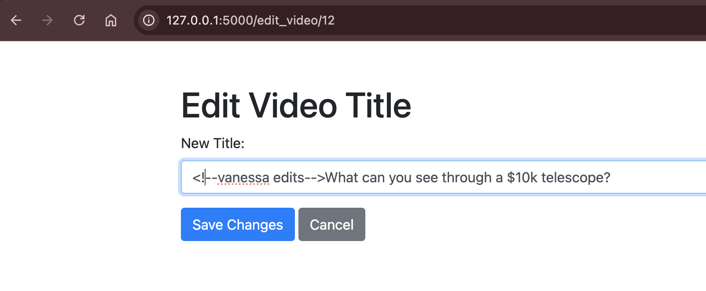
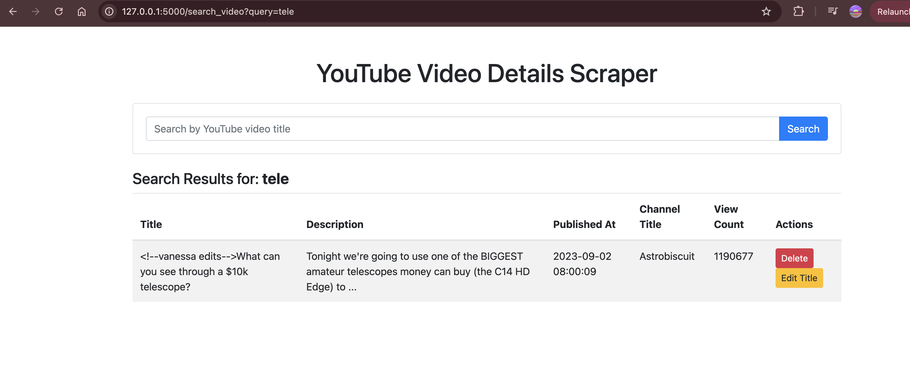

<!-- # YouTube Video Details Scraper

A Flask-based web application to scrape, store, and display details of YouTube videos. This app uses the YouTube Data API to fetch video details such as title, description, publish date, channel name, and view count, and stores them in a PostgreSQL database.

## Features

- Extracts video details from YouTube URLs.
  
- Stores the details in a PostgreSQL database.
  
- Deletes video details from the database.
- Implements rate limiting to prevent abuse of the API.
- Requires Youtube Oauth 2 Authorization for security and anti-bot measures.
  
- Uses environment variables for secure configuration. -->

## Knowledge Check - Week 3

Requirements:

- **Create HTML forms for user input (search queries, article selection)**
- **Implement client-side form validation**
- Develop Flask routes for CRUD operations (create, read, **update**, delete)
- Store data in PostgreSQL database

### Key Updates

- Added search feature that filters saved list of scraped videos by title
- Added edit button (and route) to edit video title
- Added client-side form validation for incorrect input if Youtube url does not match expectation as defined.

### Search results for "a"

### Search results for "daaimah"

### Client-side Input Validation for Youtube URL

### Editing Video Title

### Updated Video Title

