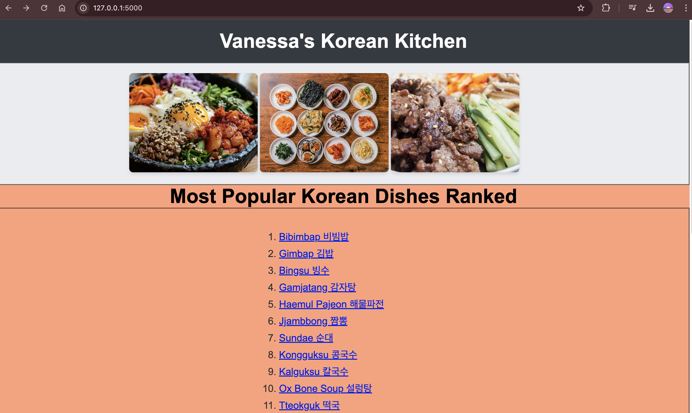
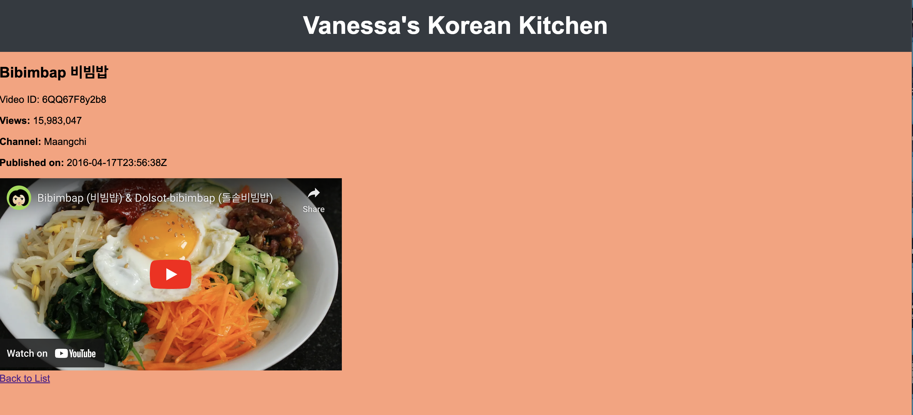
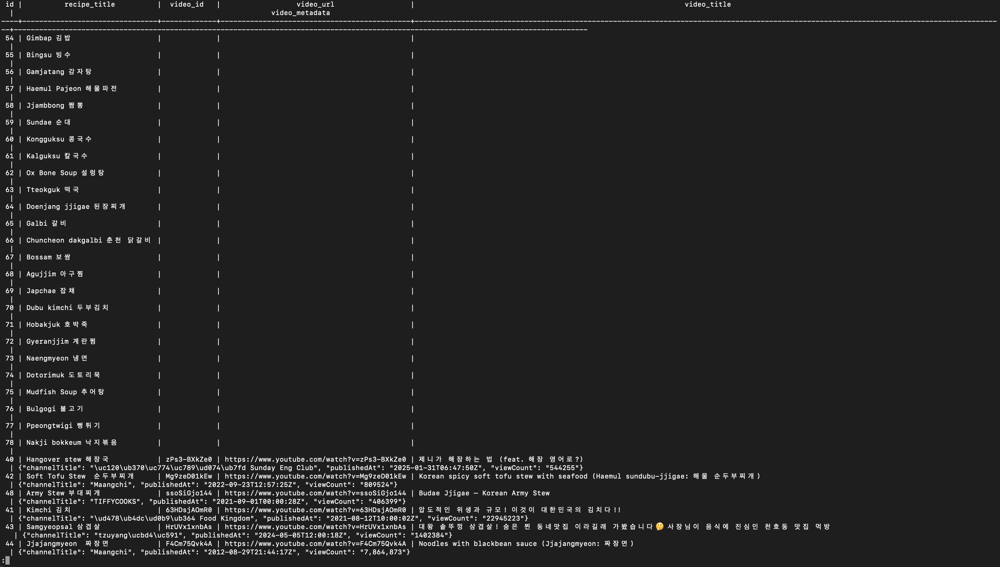
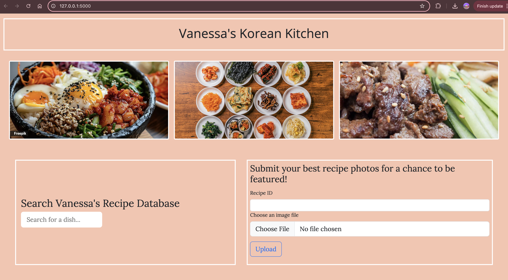
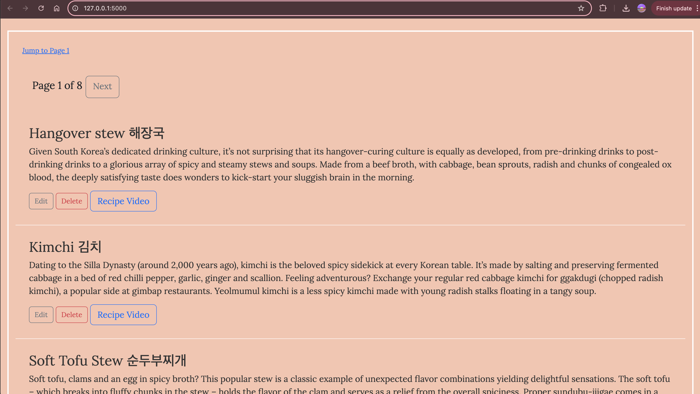
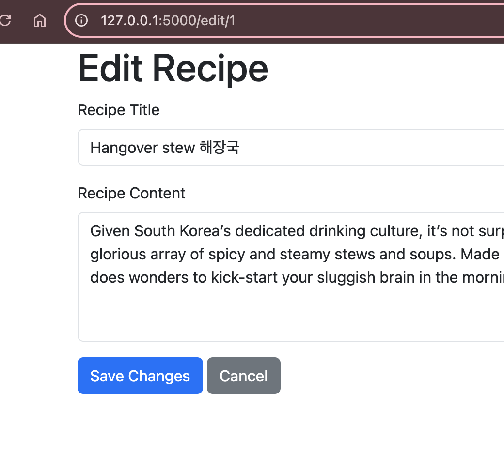
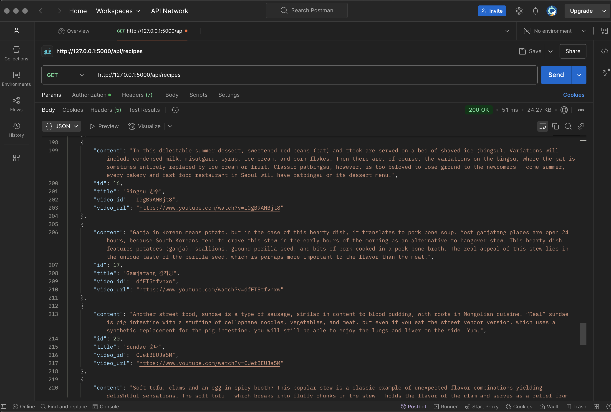
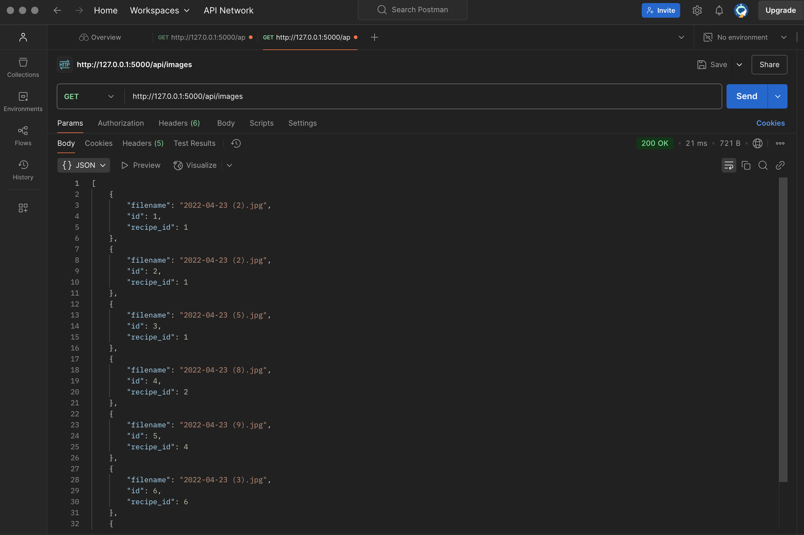

# 🍜 Korean Recipes & Top YT Videos

This is a Flask-based web application that scrapes **Korean recipe titles** from a CNN article and automatically fetches relevant **YouTube cooking videos**. Users can view recipe details, watch embedded videos, and explore metadata such as views, channel name, and publish date.

## BEFORE







## AFTER







## BACKEND





## 🎯 Features

- 🔍 **Web Scraping**: Extracts Korean recipe titles from a CNN article.
- 📺 **YouTube API Integration**: Fetches relevant cooking videos based on the recipe title.
- 🗃 **PostgreSQL Database**: Stores scraped data and YouTube metadata.
- 🖼 **Image Upload**: Allows users to upload images for recipes.
- ✏️ **Edit & Delete Recipes**: Modify or remove saved recipes.
- 📌 **Pagination & Search**: Easily browse and find recipes.
- ⏳ **Rate Limiting**: Prevents excessive API requests and ensures smooth performance.

---

## 🚀 Tech Stack

- **Backend:** Flask, Flask-SQLAlchemy
- **Database:** PostgreSQL
- **API Integration:** YouTube Data API v3
- **Other:** Python-dotenv for environment variables

---

## 🛠️ Setup Instructions

### 1️⃣ Clone the Repository

```sh
git clone https://github.com/ChasVanDav/YouTube-Video-Details-Scraper-App.git
cd YouTube-Video-Details-Scraper-App
```

### 2️⃣ Create a Virtual Environment & Install Dependencies

```sh
python -m venv venv
# Activate virtual environment:
source venv/bin/activate
# Install dependencies
pip install -r requirements.txt
```

### 3️⃣ Set Up Environment Variables

Create a `.env` file in the root directory and add:

```
YOUTUBE_API_KEY=your_youtube_api_key_here
DATABASE_URL=postgresql://your_username@localhost/your_database_name
```

### 4️⃣ Initialize the Database

```sh
python init_db.py
```

If using Flask-Migrate:

```sh
flask db upgrade
```

### 5️⃣ Run the Application

```sh
python app.py
```

Access the app at: `http://127.0.0.1:5000/`

---

## 🫱🏾‍🫲🏻 Contributing

🍴 Fork the repository

🌱 Create a new branch

`git checkout -b feature-branch`

💾 Commit your changes

`git commit -m "Added new feature"`

🚀 Push to the branch

`git push origin feature-branch`

🔥 Open a Pull Request

---

## 📜 License

This project is licensed under the MIT License.
